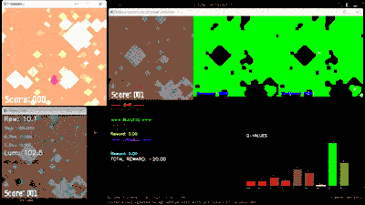

# 100KBBH Reinforcement Learning Agent

This project implements a production-ready Deep Q-Network (DQN) agent to play the "100KBBH" bullet hell game. It uses visual input (screen capture) and simulates keyboard output to control the game, learning to dodge bullets purely through trial and error.



## Key Features

*   **Visual Learning**: The agent plays using only pixels. It does not access the game's internal memory.
*   **Robust Screen Capture**:
    *   Primary: **DXCam** (High FPS, GPU-accelerated).
    *   Fallback: **MSS** (Compatible, CPU-based) with auto-retry logic to handle window flickering.
*   **Smart Automation**:
    *   **Auto-Launch**: Automatically starts the game executable if it's not running.
    *   **Window Management**: Automatically finds, restores, and focuses the game window.
    *   **Death Detection**: Uses luminance hysteresis to detect when the player dies (screen goes dark) and auto-restarts.
*   **Advanced RL Algorithms**:
    *   **Frame Stacking**: Stacks 4 consecutive frames to allow the AI to perceive bullet velocity and trajectory.
    *   **Double DQN**: Optional toggle to reduce overestimation bias and improve stability in random environments.
    *   **Experience Replay**: Stores past experiences to learn from them multiple times.
*   **Live Visualization**: Shows a "Neural View" window next to the game, displaying what the agent sees (grayscale, resized) and its current stats.

## How It Works

The AI operates in a continuous loop:

1.  **Observation**: It captures the game window, resizes it to 84x84 grayscale, and stacks the last 4 frames. This creates a "video clip" that represents the current state.
2.  **Decision**: The **Convolutional Neural Network (CNN)** analyzes this stack. It detects edges, shapes (bullets), and motion. It outputs a Q-value for each of the 9 possible actions (Idle, Up, Down, Left, Right, and Diagonals).
3.  **Action**: The agent selects the action with the highest Q-value (or a random one during exploration) and sends the corresponding keystrokes (WASD) to the game window.
4.  **Reward**:
    *   **+1** for every step it survives.
    *   **-100** if it dies (detected by the screen getting dark).
5.  **Learning**: The agent stores this sequence (State, Action, Reward, Next State) in its memory. It constantly trains its neural network on batches of these memories to improve its future decisions.

## Project Structure

*   **`env.py`**: The **Gymnasium Environment**. Handles screen capture (`dxcam`/`mss`), window management (`pywin32`), death detection, and reward calculation.
*   **`agent.py`**: The **Brain**. Contains the `CNNQNetwork` architecture (PyTorch) and the `DQNAgent` class with `act`, `learn`, `save`, and `load` methods.
*   **`train.py`**: The **Training Loop**. Orchestrates the training process, handles logging (TensorBoard/CSV), and saves checkpoints.
*   **`eval.py`**: The **Evaluator**. Runs the agent in "Greedy Mode" (no exploration) to test performance and generates HTML reports.
*   **`utils.py`**: Helper functions for generating graphs and reports.
*   **`requirements.txt`**: List of Python dependencies.

## Installation

1.  **Prerequisites**: Windows 10/11, Python 3.8+.
2.  **Install Dependencies**:
    ```powershell
    pip install -r requirements.txt
    ```

## Usage

### 1. Training
Start the training process. The script will automatically launch the game if it's in the same folder.

```powershell
# Basic Training
python train.py

# With Visualization and Double DQN
python train.py --render --double_dqn --total_episodes 1000

# Continue Training from a Checkpoint (run 50 more episodes)
python train.py --full-resume checkpoints/latest_full.pth --add-episodes 50
```

**Common Arguments:**
*   `--window_title`: Title of the game window (default: "100KBBH").
*   `--game_path`: Path to the .exe (default: "100KBBH-1.0.3.exe").
*   `--render`: Show the agent's view.
*   `--double_dqn`: Enable Double DQN algorithm.

### 2. Evaluation
Test a trained model and generate a report.

```powershell
# Run 10 test episodes
python eval.py run --checkpoint checkpoints/latest.pth --episodes 10 --render

# Generate HTML Report from logs
python eval.py report --log_dir logs
```

## Troubleshooting

*   **"Window not found"**: Ensure the game is running or the `--game_path` is correct.
*   **"gdi32.GetDIBits() failed"**: This is a temporary screen capture error. The system will automatically retry.
*   **Agent not moving**: Try running the terminal as **Administrator** (required for some DirectX games to accept input).

# Acknowledgements

*   **100KBBH**: The game used in this project is available at [100KBBH](https://github.com/EterDelta/100KBBH).
